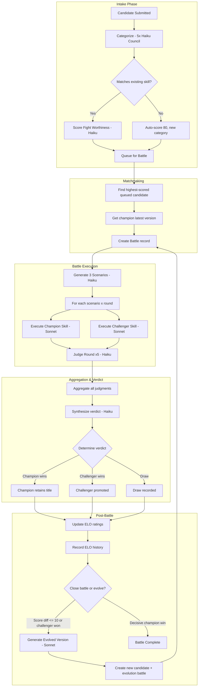

# Arena Process Flow

End-to-end pipeline from intake submission through battle to evolution.

## Full Pipeline



## LLM Calls Per Battle

| Phase | Model | Calls | Description |
|-------|-------|-------|-------------|
| Scenario Generation | Haiku | 1 | Generate 3 test scenarios |
| Skill Execution | Sonnet | 6 | 3 scenarios x 1 round x 2 skills |
| Judging | Haiku | 15 | 3 scenarios x 1 round x 5 judges |
| Verdict Synthesis | Haiku | 1 | Narrative summary of battle outcome |
| **Total per battle** | | **23** | |

Additional calls outside battle scope:
- Categorization: 5 Haiku calls per candidate (category council, majority threshold 3)
- Fight Scoring: 1 Haiku call per candidate with champion match
- Evolution: 1 Sonnet call if triggered

## Observability Tables

Three append-only tables capture the full execution trace. There is no retention or pruning logic today — they grow indefinitely.

| Table | Purpose | Write path | Read path |
|-------|---------|------------|-----------|
| `arena_llm_calls` | Every LLM API call: model, tokens, latency, cost, status, error | `callLlm()` in `lib/arena/llm.ts` (every Anthropic call funnels through it) | `executor.ts` aggregates per-battle totals into `battles.total*` columns |
| `arena_elo_history` | One row per battle per skill: before, after, change, opponent ELO, outcome | `updateRankings()` in `lib/arena/rankings.ts` | Leaderboard sparklines (`app/arena/leaderboard/page.tsx`) |
| `arena_pipeline_events` | Granular phase transitions for `candidate` and `battle` entities, with `durationMs` since previous phase | `emitPipelineEvent()` in `lib/arena/pipeline-events.ts` (self-reads to compute duration) | Internal only — no UI yet |
| `battle_rounds` (extended) | Per-execution model, tokens, latency | `executor.ts` per-round | Battle detail page |
| `battle_judgments` (extended) | Per-judge model, tokens, latency | `executor.ts` per-judgment | Battle detail page |
| `battles` (extended) | Aggregate LLM call count, tokens, cost | `executor.ts` post-battle aggregation from `arena_llm_calls` | Battle list, leaderboard |

`emitPipelineEvent(db, entityType, entityId, phase, metadata?)` is the single helper to write pipeline events. It reads the most recent event for the entity, computes `durationMs`, and inserts. Callers in `executor.ts` and `evolution.ts` use it to mark phases listed in [Pipeline Event Flow](#pipeline-event-flow) below.

Cost is computed at write time by `calculateCostCents(model, inputTokens, outputTokens)` in `lib/arena/costs.ts` (Haiku: 1¢/5¢ per million in/out; Sonnet: 3¢/15¢).

## Pipeline Event Flow

Two systems track lifecycle progress: **database statuses** (terminal/durable state on the row) and **pipeline events** (granular phase transitions written to `arena_pipeline_events` for observability). Pipeline events are finer-grained than statuses.

### Candidate

**DB status** (`intake_candidates.status` enum):
```
new -> categorized -> scored -> queued -> battling -> promoted | rejected | dismissed
```

**Pipeline events** (informational, emitted via `emitPipelineEvent`):
```
categorizing, scoring  (in addition to the status transitions above)
```

### Battle

**DB status** (`battles.status` enum):
```
pending -> running -> judging -> complete | failed | cancelled
```

**Pipeline events** (informational):
```
creating_battle -> generating_scenarios -> executing_rounds -> aggregating -> evolving -> evolved
```
