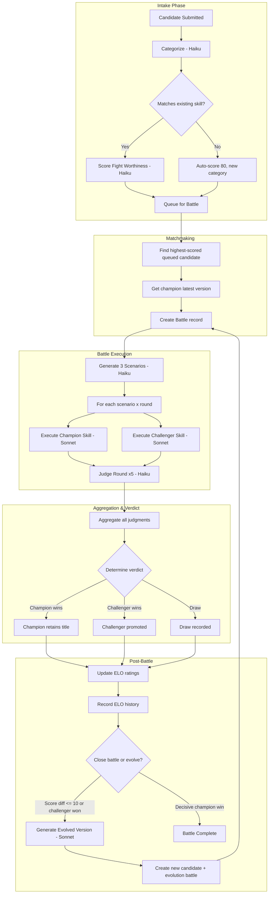

# Arena Process Flow

End-to-end pipeline from intake submission through battle to evolution.

## Full Pipeline



## LLM Calls Per Battle

| Phase | Model | Calls | Description |
|-------|-------|-------|-------------|
| Scenario Generation | Haiku | 1 | Generate 3 test scenarios |
| Skill Execution | Sonnet | 6 | 3 scenarios x 1 round x 2 skills |
| Judging | Haiku | 15 | 3 scenarios x 1 round x 5 judges |
| **Total per battle** | | **22** | |

Additional calls outside battle scope:
- Categorization: 1 Haiku call per candidate
- Fight Scoring: 1 Haiku call per candidate with champion match
- Evolution: 1 Sonnet call if triggered

## Observability Tables

| Table | Purpose |
|-------|---------|
| `arena_llm_calls` | Every LLM API call with tokens, latency, cost, status |
| `arena_elo_history` | ELO snapshots per battle for trend analysis |
| `arena_pipeline_events` | Phase transitions with timestamps and duration |
| `battle_rounds` (extended) | Per-execution model, tokens, latency |
| `battle_judgments` (extended) | Per-judge model, tokens, latency |
| `battles` (extended) | Aggregate LLM call count, tokens, cost |

## Pipeline Event Flow

### Candidate Lifecycle
```
submitted -> categorizing -> categorized -> scoring -> scored -> queued -> battling -> promoted/rejected
```

### Battle Lifecycle
```
creating_battle -> generating_scenarios -> executing_rounds -> judging -> aggregating -> complete
                                                                                      -> evolving -> evolved
                                                                                      -> failed
```
